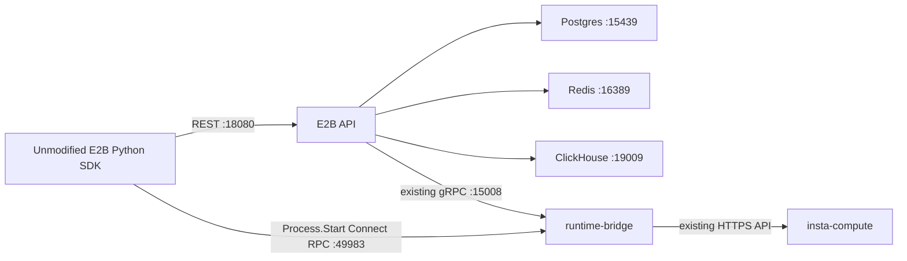

# E2B control plane → Insta runtime POC

This fork proves that E2B's API, authentication, sandbox catalog and lifecycle can drive an external runtime. Only this E2B repository is modified. `insta-compute` is a temporary backend accessed through its existing HTTP API; a future `insta-sandbox` or `insta-vm` can implement the small `backend.Runtime` interface.

Upstream baseline: `e2b-dev/runtime@82eaa9502d3c625c6e3b35696109e1b8ad264312`.

## Topology



`packages/runtime-bridge/bridge` implements E2B's orchestrator and process protocols. `packages/runtime-bridge/backend` defines `Create`, `Get`, `Delete`, and `Exec`; `packages/runtime-bridge/compute` translates those operations to compute services. No Firecracker orchestrator, template builder, client-proxy or guest envd runs in this POC.

The API uses its existing local service discovery. A default-off `RUNTIME_BRIDGE_POC=true` API middleware permits only health, create, get/list, delete and timeout updates. Unsupported REST operations return 501 before entering lifecycle handlers. The bridge also rejects unsupported create options before calling compute.

One fixed E2B team maps to one dedicated compute tenant/branch. Template `instapoc` maps to `BRIDGE_IMAGE`; each sandbox becomes one always-on worker service named `e2b-<sandbox-id>`, with port 0, one replica and `sh -c 'exec sleep infinity'`. The image must provide `env`, `sh`, and `sleep infinity` (tested with `python:3.12-slim`).

## Run

Prerequisites: Docker Compose, Go compatible with `go.work` (tested with Go 1.27.0), Python 3.9+, and an isolated compute tenant/branch with an authorized tenant token. The runner provisions only local dependencies and sandbox services; it does not provision tenants or change compute infrastructure.

From the repository root:

```sh
python3 -m venv poc/insta/.local/venv
poc/insta/.local/venv/bin/pip install -r poc/insta/requirements.txt

export INSTA_COMPUTE_URL=https://YOUR_COMPUTE_API
export INSTA_COMPUTE_TENANT=YOUR_ISOLATED_TENANT
export INSTA_COMPUTE_BRANCH=poc
export INSTA_COMPUTE_REGION=us-west-1
export BRIDGE_IMAGE=python:3.12-slim
# Supply INSTA_COMPUTE_TOKEN through your secret manager or a private shell environment.
poc/insta/.local/venv/bin/python poc/insta/run.py --smoke
```

The runner builds the API and bridge, applies upstream Postgres/ClickHouse migrations, seeds one team/API key and the template mapping, and runs the SDK smoke test. It stops the two local processes on exit. Docker dependencies remain available for another run. Logs, binaries, API key, state and test evidence are under ignored `poc/insta/.local/` with private permissions. The state contains sandbox access tokens and environment values: keep it private and do not commit it.

Omit `--smoke` to leave the API and bridge running. In another shell:

```sh
export E2B_API_URL=http://127.0.0.1:18080
export E2B_SANDBOX_URL=http://127.0.0.1:49983
export E2B_API_KEY="$(cat poc/insta/.local/api-key)"
poc/insta/.local/venv/bin/python
```

```python
from e2b import Sandbox

sandbox = Sandbox.create("instapoc", timeout=60)
try:
    result = sandbox.commands.run("python -c 'print(40 + 2)'", user="root")
    print(result.stdout)
finally:
    sandbox.kill()
```

Use `E2B_SANDBOX_URL`; do not use SDK debug mode to bypass creation. Commands require `user="root"`. The bridge binds loopback; upstream API HTTP/internal gRPC listeners may bind all interfaces, so run on a private development host and do not publish their ports. This is a local, single-team POC, not a public deployment configuration.

## Supported and rejected behavior

### Interactive demo

With the same prerequisites and environment variables as above, run:

```sh
poc/insta/.local/venv/bin/python poc/insta/run.py --demo
```

Open `http://127.0.0.1:18780`. Create a sandbox, run the environment example, then
try writing and reading `/tmp/demo.json` to show state persists between commands.
The error example demonstrates separate stdout/stderr and exit code 7. The page
also supports renewal and deletion, shows the real sandbox ID and counts down
the 180-second lifetime. Commands use the published E2B SDK through the existing
POC; no mock execution mode is included.

The demo admits one sandbox at a time. Execution is buffered and limited to 55
seconds. Refreshing the page preserves the server-side session; closing the tab
leaves the sandbox running until its deadline while the API/bridge remain up.
Ctrl-C or SIGTERM to the runner stops the demo first and attempts sandbox deletion;
allow up to 90 seconds for an in-flight command and cleanup. Forced termination
requires restarting the bridge with its journal to recover pending resources.

The demo listens only on `127.0.0.1`, validates Host/Origin and a per-process browser
token, and keeps the E2B key on the server. It is intended for one trusted local
user; do not expose it through a public proxy. Use the literal loopback address,
not a custom hostname. Stopping the runner does not delete the dedicated compute
tenant or the local Docker dependencies.

```sh
python -m unittest discover -s poc/insta -p 'test_demo.py' -v
```

Browser validation covered create, environment inspection, file persistence,
stdout/stderr with exit code 7, and renewal. A real foreground-process-group
SIGINT test confirmed deletion through the compute API before runner exit.

### Capability matrix

| Operation | POC behavior |
|---|---|
| Create/get/list/delete | Real E2B API and real compute service |
| CPU/memory | vCPU × 1000 → cpu_milli; RAM MiB → memory_mib |
| Create readiness | Polls compute until running; failed/canceled create triggers compensating deletion |
| Timeout/update | Durable bridge deadline plus upstream control-plane lifecycle |
| Command execution | Root, foreground, buffered stdout/stderr/exit code; env and cwd supported |
| Bridge restart | Reloads live records; retries interrupted creation/deletion cleanup |
| Pause/resume/checkpoint/fork/template builds | Unsupported; REST guard rejects lifecycle mutations |
| Files, PTY, stdin, process attach/signals/list | Unsupported |
| Live output, background commands, exposed ports | Unsupported; Start cannot distinguish every SDK background invocation |
| Volumes, IAM, restricted egress/ingress | Unsupported; requested create options rejected |

The process listener implements a subset of the envd wire protocol, not a guest agent. Output is sent only after compute `/exec` returns; the first stdout line of a shell wrapper carries the real process PID. Commands have a 60-second execution limit and an 8 MiB compute response limit. Killing the sandbox removes the service; cancellation of an individual HTTP request does not prove the remote process was killed.

## Recovery and cleanup

The bridge journals before creating a service, atomically persists updates, and serializes operations per sandbox. A file lock prevents two bridge processes from sharing state. State is bound to the compute URL/tenant/branch; restarting with different scope is rejected. Keep that state and restart the bridge after a crash so it can clean pending operations and expired sandboxes. Do not delete the state while services remain. This is not distributed ownership or HA.

Kill active sandboxes while the runner is available, confirm the dedicated compute branch has no `e2b-*` services, then stop the runner. To remove only local POC containers and their data:

```sh
docker compose -p e2b-insta-poc -f poc/insta/compose.yaml down -v
```

Do not change the tenant/branch and reuse a live journal. To test another backend, use a fresh isolated state directory after confirming cleanup.

## Verification

```sh
go test -race ./packages/runtime-bridge/... ./packages/api/internal/middleware/...
go build ./packages/api ./packages/runtime-bridge/cmd/runtime-bridge
```

`smoke.py` uses published `e2b==2.10.2` without SDK patches. It checks create/get/list, env/cwd/quoting, stdout/stderr/nonzero exit code, unsupported pause, bridge restart, timeout update, deletion and expiry. Deletion and expiry are checked independently against the compute API. Mock contract tests cover readiness, backend failure, canceled creation, persistence failures, auth and recovery; those tests are not evidence of production durability.

On 2026-10-01, the full smoke passed against an isolated staging compute tenant, including a 7-second command that completed after its original 5-second sandbox timeout was extended during execution. The final run's create took 7.086 seconds; this is a single observation, not a benchmark. Go race tests, builds, repository Go formatting/lint checks and Python formatting/lint/compilation checks passed. The test services were removed, with deletion and expiry independently confirmed by the compute API.

See [GAPS.md](GAPS.md) for the future runtime contract and known limitations.
